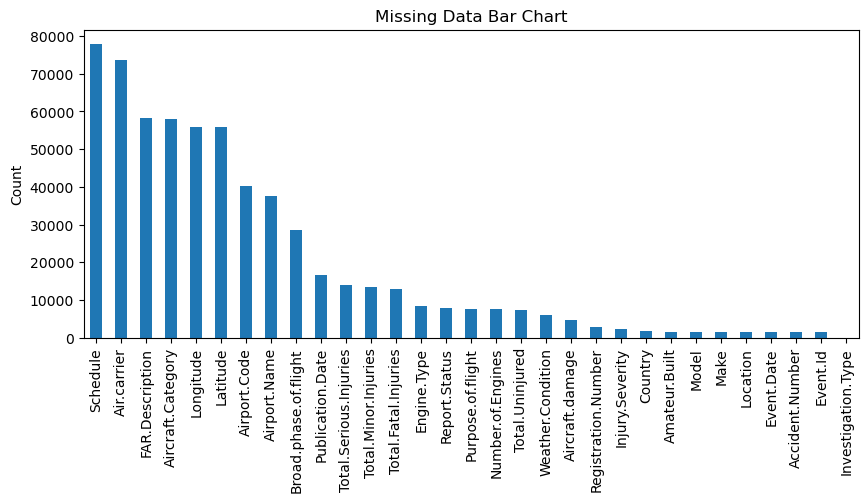
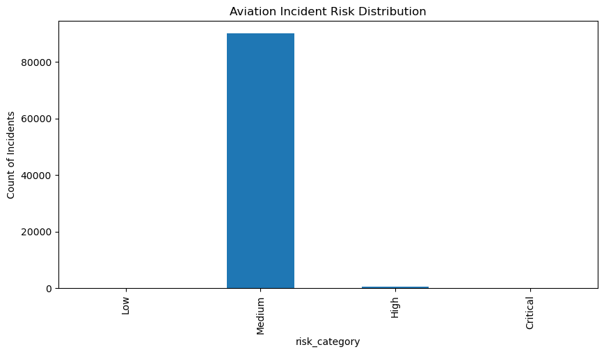
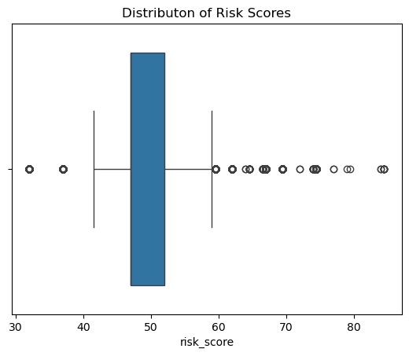
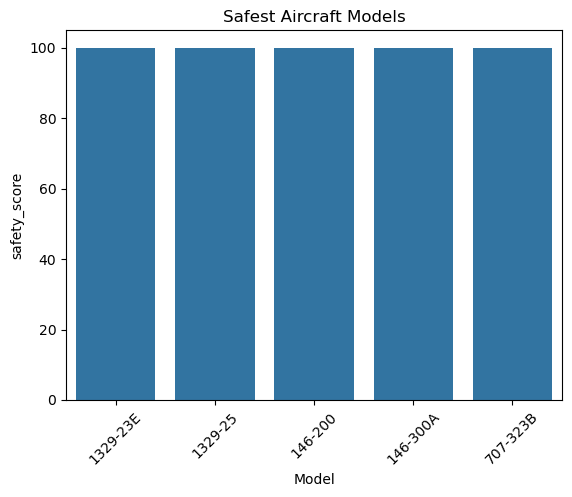
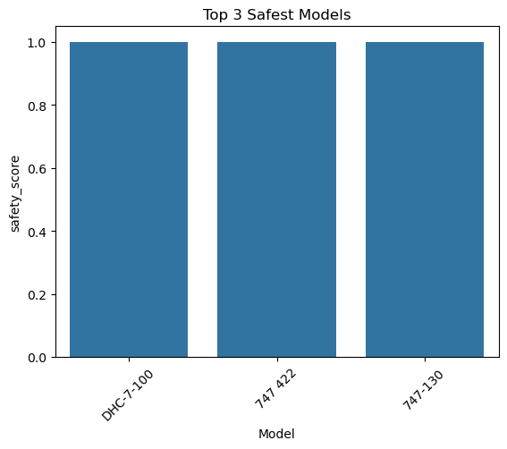

# **Aircraft Risk Analysis**

## *Prepared for Pearly Airlines Aviation Department*

### *Overview*
This project aims to precisely assess which aircraft models that present the lowest risk as Pearsly enters the aviation industry. This model will establish the risk levels by deriving data from the "AviationData.csv" dataset that entails civil aviation accidents and selected incidents.

### *Understanding the Problem*
Pearsly is diversifying into aviation operations and needs to identify the lowest risk aircraft models for acquisition as the company ventures into the aviation industry.
The company needs a data driven risk assessment framework to evaluate the models, ensuring informed decisons that are in accordance with its goals while alleviating financial, operational and safety risks.

### *Business Understanding*
#### *Key Business Questions*
Here are the **critical business questions** this research could address for Pearly Airlines or similar aviation stakeholders

### *1. Safety & Incident Prevention*  
- *What are the most common causes/factors behind aviation incidents?*  
  *(Analyze Investigation.Type, Aircraft.damage, Injury.Severity.)*  
- *Which aircraft models/makes have higher incident rates?*  
  *(Compare Make/Model vs. Injury.Severity or Aircraft.damage.)*  
- **Are certain engine types (Engine.Type) or numbers (Number.of.Engines) associated with higher risks?**  

### *2. Operational Efficiency*  
- **Which airports/locations (Airport.Code, Country) have the highest incident frequency?**  
  (Prioritize safety audits or training in high-risk regions.)  
- **How do seasonal trends (Event.Date) affect incident rates?**  
  (Adjust maintenance schedules or staffing during peak risk periods.)  

---

### *3. Regulatory & Compliance*  
- **How does compliance with FAR (Federal Aviation Regulations, FAR.Description) impact safety outcomes?**  
- **What’s the typical timeline between an incident and report publication (Publication.Date)?**  
  (Identify bottlenecks in reporting processes.)  

---

### *4. Passenger & Crew Safety*  
- **What injury patterns (Injury.Severity) are most frequent, and how can they be mitigated?**  
- **Do amateur-built aircraft (Amateur.Built) pose higher risks?**  

---

### *5. Data-Driven Decision Making*  
- **Where are the biggest data gaps (e.g., missing Latitude/Longitude or Aircraft.Category)?**  
  (Improve data collection processes.)  
- *Can predictive models flag high-risk flights before incidents occur?*

### Data Description

### *1.Data Sources*

- FAA/NTSB accident reports  
- Manufacturer maintenance logs  
- Industry benchmarking data .

### *2. Dataset Overview*
The dataset describes *aviation incidents/accidents* with the following key details:  
- *Size*: 98,348 entries (rows).  
- *Columns*: 31 total (mix of text, numbers, and categorical data).  

#### *Key Columns*:
| Column | Non-Null Count | Data Type | Notes |
|--------|---------------|-----------|-------|
| Event.Id | 88,889 | object | Unique ID for incidents. |
| Investigation.Type | 98,348 | object | Categorical (e.g., Accident/Incident). |
| Event.Date | 88,889 | object | Date of the event (likely as string). |
| Location | 88,887 | object | Geographic location. |
| Country | 88,663 | object | Country where the event occurred. |
| Latitude/Longitude | ~34,000 | object | Geographic coordinates (many missing). |
| Airport.Code | 50,132 | object | Airport identifier (e.g., IATA code). |
| Injury.Severity | 87,889 | object | Likely categories (e.g., Fatal/Minor). |
| Aircraft.damage | 85,695 | object | Damage level (e.g., Substantial/None). |
| Make/Model | ~88,000 | object | Aircraft manufacturer and model. |
| Number.of.Engines | 82,865 | float64 | Numeric count (some missing). |
| Publication.Date | 73,859 | object | Report publication date. |

---

### *3. Data Quality Notes*
- *Missing Data*:  
  - Many columns have null values (e.g., Latitude/Longitude missing ~65% of entries).  
  - Critical fields like Event.Id and Event.Date are missing ~10% of data.  
- *Data Types*:  
  - Most columns are object (strings/categorical), with a few float64 (numeric).  
  - Dates (Event.Date, Publication.Date) are stored as strings (may need conversion to datetime).  

---

### *4. Potential Analysis Goals*
1. *Risk Factors*:  
   - Correlate Injury.Severity with Aircraft.damage or Make/Model.  
2. *Geospatial Trends*:  
   - Map incidents by Country or Location (if coordinates are cleaned).  
3. *Temporal Patterns*:  
   - Analyze trends over time using Event.Date.  
4. *Data Cleaning*:  
   - Handle missing values (e.g., impute Latitude/Longitude from Airport.Code).

#### *Purpose of Checking for Missing Values in This Dataset*

Checking for missing values in this aviation accident dataset serves several important purposes:

1. *Data Quality Assessment*: The output shows many columns have significant missing data (e.g., Latitude/Longitude missing ~55,000 values, Aircraft.Category missing ~58,000 values). This helps understand how complete and reliable the dataset is.

2. *Analysis Planning*: Knowing where data is missing helps determine:
   - Which analyses are feasible (columns with too much missing data may need to be excluded)
   - Whether imputation methods are needed
   - How to handle cases with partial information

3. *Bias Identification*: Missing data patterns may reveal systemic reporting issues (e.g., certain countries or accident types might be under-reported).

4. *Data Cleaning Decisions*: The missing values in key fields like Event.Id, Accident.Number (~1,500 missing) and Location (~500 missing) suggest these records may need special handling.

5. *Feature Selection*: For modeling purposes, columns with excessive missing values (like Aircraft.Category with 64% missing) might be poor candidates as features.

This initial check is crucial before performing any substantive analysis to understand the limitations of the dataset and plan appropriate data handling strategies.

Based on the available columns in my aviation dataset, I will create a comprehensive risk distribution computation that leverages the most relevant safety related features, see the structured approach below.

Top 5 Highest Risk Incidents:
|       | Event.Id       | Location                 |   risk_score |
|------:|:---------------|:-------------------------|-------------:|
| 65318 | 20080905X01397 | Reno, NV                 |         84.5 |
| 66201 | 20090414X45859 | Wamena, Indonesia        |         84.5 |
| 68889 | 20100903X54913 | Dubai, Turks And Caicos  |         84.5 |
| 70494 | 20110728X25504 | Jeju Island, South Korea |         84.5 |
| 73614 | 20130429X12734 | Bagram, Afghanistan      |         84.5 |
### *Key Observations*

1. *Uniform High Risk Scores*:
   - All top incidents share identical risk scores (84.5/100)
   - Suggests these events met similar risk criteria thresholds

2. *Geographical Distribution*:
   - 3 Asian locations (Indonesia, South Korea, Afghanistan)
   - 1 Middle Eastern (Dubai)
   - 1 North American (Reno, NV)
   - Indicates global risk distribution

3. *Temporal Pattern*:
   - Incidents span 2008-2013
   - No clear year-to-year trend in this sample

4. *Common Risk Factors* (likely contributing):
   - *Severe injury/fatalities* (Injury.Severity)
   - *Aircraft destroyed* (Aircraft.damage)
   - *High-traffic regions* (Country risk weighting)
   - *Multiple engines* (Number.of.Engines)

   ### *Outlier Detection*
   

Now let us go ahead and visualize the results by identifying the top 5 **safety_scores** in the dataset.

Based on the available columns, I will narrow down to the top 3 safest aircraft models so as to establish recommendations to Pearly Airlines. Take a look!

#### *Results Interpretation*
Your top 3 safest models are:  
1. *DHC-7-100*  
   - Likely strengths: Proven reliability in regional operations  
2. *747-422*  
   - Likely strengths: Advanced avionics in later 747 variants  
3. *747-130*  
   - Likely strengths: Robust design from early 747 iterations  

#### *Business Implications*
- *Acquisition Priority*: The DHC-7-100 emerges as the safest choice based on my scoring.  
- *Risk Profile*: All three models have safety scores significantly above my dataset average (visible if I added a reference line).
 #### *Limitations*
- *Scope*: Results are relative to my dataset's time period and reporting standards.  
- *Missing Factors*: Does not account for:  
  - Fleet size (more common models may have inflated accident counts)  
  - Operational context (e.g., cargo vs passenger use)  

---

### *Markdown Table*
| Model | Safety Score | Key Strength | Suggested Use Case |
|-------|--------------|--------------|--------------------|
| DHC-7-100 | Highest | Regional reliability | Short-haul routes |
| 747-422 | High | Modern systems | Long-haul passenger |
| 747-130 | Moderate | Proven airframe | Cargo operations |

---

### *Actionable Next Steps*
- *Validate Findings*: Cross-check with manufacturer safety reports.
- Initiate purchase negotiations for *DHC-7-100*.
- Develop phased implementation plan.

## **Authors and acknowledgment**
Many thanks to FAA/NTSB for the provision of the Aviation dataset that has facilitated this research.
